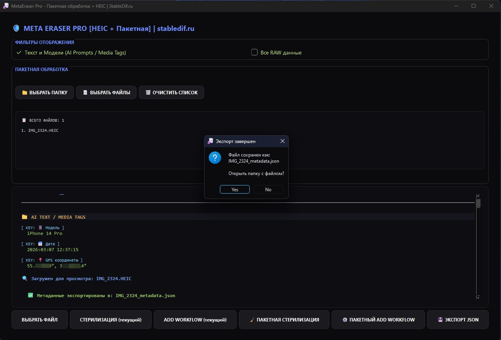

# 🛡️ MetaEraser Pro
**MetaEraser Pro** is a powerful and stylish tool for managing the metadata of your media files. Specifically optimized for AI workflows (Stable Diffusion, ComfyUI), it allows you to completely strip "digital footprints" or integrate complex Workflows directly into images and videos.

## ✨ Key Features
- **🔍 Deep Analysis:** Recursively searches for hidden tags, prompts, and model settings (Checkpoint, LoRA, VAE) within files.
- **🧼 Sterilization (Cleaning):** Complete removal of metadata from images (PNG, JPG, WebP) and video/audio files without loss of content quality. 
- **💉 Workflow Injection:** A unique feature to embed JSON workflows into files. Perfect for **ComfyUI** — simply drag and drop the created video or image into the interface, and the graph restores automatically!
- **🎥 Video Support:** Handles MP4/MOV metadata atoms (iTunes metadata), which is critical for the Video Helper Suite in ComfyUI.
- **🎧 Audio Tags:** Clean and write data in MP3, WAV, and FLAC formats.
- **🎨 Modern Interface:** Stylish dark theme inspired by Tokyo Night, featuring intuitive controls and Drag-and-Drop support.
  

## 🚀 Supported Formats

|**Type**|**Formats**|
|---|---|
|**Images**|PNG, JPG, JPEG, WebP, TIFF|
|**Video**|MP4, MOV, M4V|
|**Audio**|MP3, WAV, FLAC, M4A|

## 🛠️ How to Use
1. **Select File:** Drag and drop the desired file into the application window or click "SELECT FILE".
2. **View:** Examine the current metadata. Use the "AI Text / Media Tags" filter to quickly find prompts.
3. **Clean:** Click "STERILIZATION" to make the file absolutely "clean".
4. **Add Workflow:** Click "ADD WORKFLOW," select your `.json` file, and the data will be embedded with maximum compatibility for AI tools.

---

## 👨‍💻 About the Author

**OreX** from the **StableDif.ru** team — creating tools to simplify AI workflows.
- 📺 **YouTube:** [Stable Diffusion in Russian](https://www.youtube.com/@StableDiff) — tutorials and reviews.
- 📢 **Telegram:** [@stabledif_lesson](https://t.me/stabledif_lesson) — latest news and useful guides.
- 🚀 **Boosty:** [StableDif on Boosty](https://boosty.to/stabledif) — exclusive content and project support.

  # Русская версия
# 🛡️ MetaEraser Pro
**MetaEraser Pro** — это мощный и стильный инструмент для управления метаданными ваших медиафайлов. Приложение специально оптимизировано для работы с нейросетями (Stable Diffusion, ComfyUI), позволяя не только полностью очищать файлы от «цифровых следов», но и интегрировать рабочие процессы (Workflows) прямо в изображения и видео.

## ✨ Основные возможности
- **🔍 Глубокий анализ:** Рекурсивный поиск скрытых тегов, промптов и настроек моделей (Checkpoint, LoRA, VAE) внутри файлов.
- **🧼 Стерилизация (Очистка):** Полное удаление метаданных из изображений (PNG, JPG, WebP) и видео/аудио файлов без потери качества контента.
- **💉 Интеграция Workflow:** Уникальная функция внедрения JSON-воркфлоу в файлы. Идеально подходит для **ComfyUI** — просто перетащите созданное видео или картинку в интерфейс, и схема восстановится автоматически!
- **🎥 Поддержка Видео:** Работа с атомами метаданных MP4/MOV (iTunes metadata), что критически важно для Video Helper Suite в ComfyUI.
- **🎧 Аудио-теги:** Очистка и запись данных в MP3, WAV, FLAC.
- **🎨 Современный интерфейс:** Стильная темная тема в духе Tokyo Night, интуитивно понятное управление и поддержка Drag-and-Drop.
    

## 🚀 Поддерживаемые форматы
|**Тип**|**Форматы**|
|---|---|
|**Изображения**|PNG, JPG, JPEG, WebP, TIFF|
|**Видео**|MP4, MOV, M4V|
|**Аудио**|MP3, WAV, FLAC, M4A|

## 🛠️ Как использовать
1. **Выбор файла:** Просто перетащите нужный файл в окно программы или нажмите кнопку «ВЫБРАТЬ ФАЙЛ».
2. **Просмотр:** Изучите текущие метаданные. Используйте фильтр «Текст и Модели» для быстрого поиска промптов.
3. **Очистка:** Нажмите «СТЕРИЛИЗАЦИЯ», чтобы сделать файл абсолютно «чистым».
4. **Добавление Workflow:** Нажмите «ADD WORKFLOW», выберите ваш `.json` файл, и данные будут внедрены с максимальной совместимостью для нейросетей.
    
---

## 👨‍💻 Об авторе
**OreX** из команды **StableDif.ru** — создаем инструменты для упрощения работы с нейросетями.
- 📺 **YouTube:** [Stable Diffusion по-русски](https://www.youtube.com/@StableDiff) — обучающие уроки и обзоры.
- 📢 **Telegram:** [@stabledif_lesson](https://t.me/stabledif_lesson) — свежие новости и полезные гайды.
- 🚀 **Boosty:** [StableDif на Boosty](https://boosty.to/stabledif) — эксклюзивный контент и поддержка проекта.
